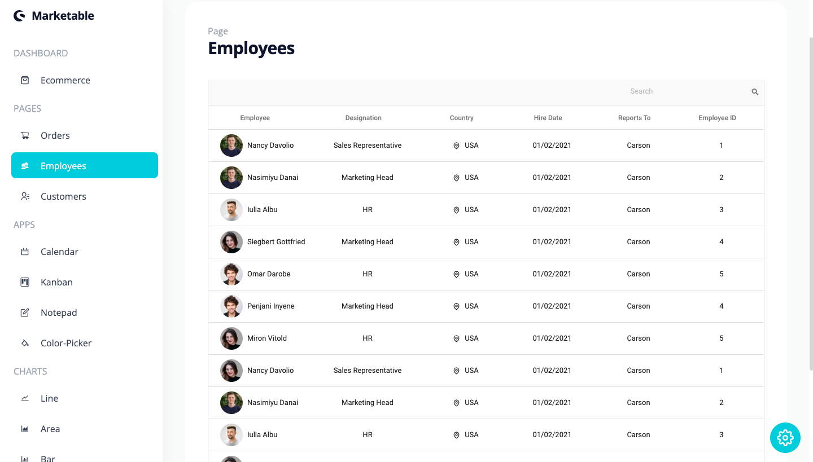

*"Marketable"*
===========
Learn more about the developer: 

LinkedIn: https://www.linkedin.com/in/nhathoangdev/

Portfolio: https://nhoang1122.github.io/

Project Deployed On: https://dash-board-marketable.vercel.app/

*"Marketable"* is a Full-Stack Fully Responsive ECommerce DashBoard Application. Users can keep track of their Revenue Budget, Earnings, Orders, and Customer Reports. Users have a Built In Calendar and a Kanban App to organize tasks. 

#### Technologies
React, JavaScript, CSS, TailWind

#### Version 2.0

###### TimeSheet
In the future, I'd like to add a TimeSheet Option for Employees